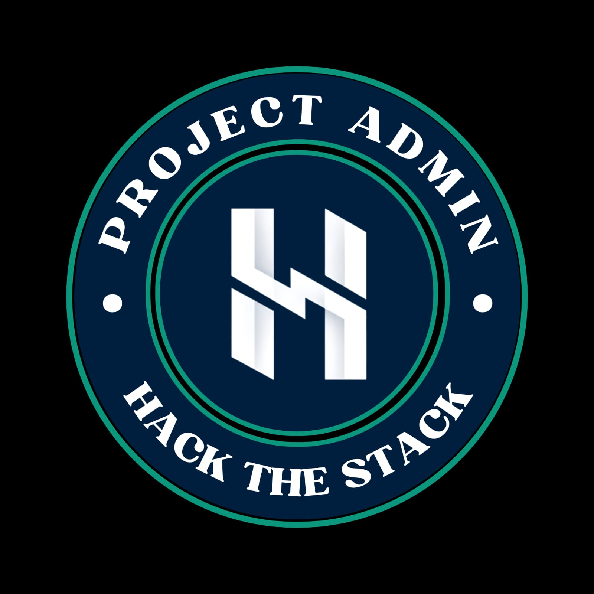

Hi 👋 I'm Nima Maria Jacob
=================================

🎓 Fourth-Year Computer Science Student

💻 Interested in Python, Flask, AI, and Web Development

⚡Currently exploring Backend Development and Cloud Technologies

🤝 Open to collaboration on exciting tech projects

* ✉️  You can contact me at [nimamariajacb@gmail.com](mailto:nimamariajacb@gmail.com)
* 🧠  I'm currently learning MERN Stack and Generative AI

### Socials

 <a href="https://www.github.com/NimaMaria" target="_blank" rel="noreferrer"> <picture> <source media="(prefers-color-scheme: dark)" srcset="https://raw.githubusercontent.com/danielcranney/readme-generator/main/public/icons/socials/github-dark.svg" /> <source media="(prefers-color-scheme: light)" srcset="https://raw.githubusercontent.com/danielcranney/readme-generator/main/public/icons/socials/github.svg" />  </picture> </a> <a href="https://www.linkedin.com/in/nima-maria-jacob" target="_blank" rel="noreferrer"> <picture> <source media="(prefers-color-scheme: dark)" srcset="https://raw.githubusercontent.com/danielcranney/readme-generator/main/public/icons/socials/linkedin-dark.svg" /> <source media="(prefers-color-scheme: light)" srcset="https://raw.githubusercontent.com/danielcranney/readme-generator/main/public/icons/socials/linkedin.svg" />  </picture> </a>

### Badges

  
  
  

### My GitHub Stats

 
 

